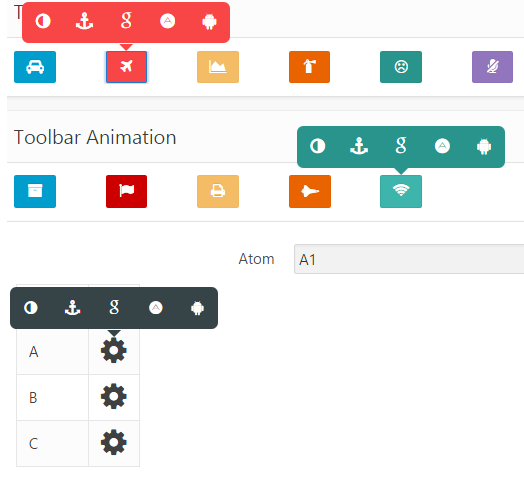

# Oracle APEX Dynamic Action Plugin - ContextualToolbar

Contextual Toobar is an Dynamic Action plugin that allows users to quickly create tooltip style toolbars for use in web applications and websites. The toolbar is easily customisable using [Font Awesome](http://fortawesome.github.io/Font-Awesome/) icons and provides flexibility around the toolbars display and number of icons.

It is based on [Toolbar.Js](http://paulkinzett.github.io/toolbar/).

## Donation

Your support means a lot.

[](https://www.paypal.me/MYasirAliShah/4)


## Changelog

### 1.1 - After Refresh Bug Fixed
### 1.0 - Initial Release

## Install

- Import plugin file "dynamic_action_plugin_com_planetapex_contextualtoolbar.sql" from source directory into your application
- (Optional) Deploy the CSS/JS files from "src" directory on your webserver and change the "File Prefix" to webservers folder.


## Preview



## Demo Application

[Contextual Toolbar](https://apex.oracle.com/pls/apex/f?p=83009:20 "Contextual Toolbar Homepage")

## Plugin Features

- Toolbar attached to single Items including: Buttons, links, Input Items.
- Toolbar attached to Report Columns.
- Toolbar Action
  - Page No
  - Page URL
  - Javascript Function
- Toolbar Source
  - Static List
  - Query
  - List
    - Static based
    - Query based
- Font-Awesome icons support.
- Toolbar Animations
- Toolbar Triggering item Styling.
- Toolbar Styling.
- Click & Hover show events.
- Toolbar Item Events including: click, double click, hover, mouse button pressed, mouse button released.

## Plugin Settings

### How to Attach Toolbar to Item

1) Create a Dynamic Action 
- [X] **Event**: Page Load
- [X] **Action**: Contextual Toolbar.
- [X] **Affected Element**:Select 
  - [X] Item
  - [X] Button
  - [X] Region
  - [X] jQuery Selector
  - [X] Javascript expression

OR 

2) Create a Dynamic Action 
- [X] **Event**: After Refresh of Report/Region
- [X] **Action**: Contextual Toolbar.
- [X] **Affected Element**:Select 
  - [X] Item
  - [X] Button
  - [X] Region
  - [X] jQuery Selector
  - [X] Javascript expression


### Toolbar Source

Following provide help and examples regarding toolbar source.

#### Static List

Static list should be **comma-delimited** list of entries. Each entry has three parts separated by **semi-colon** (**;**) .
For example: **fa-plane;1;Page 1**

- [X] **fa-plane** is the icon for the toolbar.
- [X] **1** is the page No to redirect to.
- [X] **Page 1** is the tooltip for the icon.

Following provide example(s) for Static List:

```pl/sql
STATIC:fa-plane;1;Page 1,fa-car;f?p=&APP_ID.:2:&SESSION.;Page 2,fa-cog;alert("ola");Javascript Function
```

> **Page No Part**
> can Contain Page No, Page URL or a Javascript Function

> **List definition** can be with or without the STATIC or STATIC2 keywords.

#### Query

Query should countain list of entries for the toolbar. Each entry has three parts identified by the three columns of the query.
For example: **Select 'fa-plane', '1', 'Page 1'**

- [X] **fa-plane** is the icon for the toolbar.
- [X] **1** is the page No to redirect to.
- [X] **Page 1** is the tooltip for the icon.

Following provide example(s) for Query:

```pl/sql
Select 'fa-plane', '1', 'Page 1'
  from dual
Union All
Select 'fa-car', 'f?p=&APP_ID.:2:&SESSION.', 'Page 2'
  from dual
Union All
Select 'fa-cog', 'alert("hola")', 'Javascript Function'
  from dual
```

#### List

##### Static

Static list of entries for the toolbar. Each entry has three parts that can be defined as following:

- [X] **Image/Class**  fa-plane.
- [X] **Target** can be:
  - Page in Application
  - URL
    - Any valid Web Page Or
    - Javascript Function
- [X] **List Entry Label** is the tooltip for the icon.

Following provide example(s) for Query:

>- **Image/Class** :**fa-plane**
>- **Target**:Page in Application **1**
>- **List Entry Label**:Page 1

Other entry

>- **Image/Class**:fa-cog.
>- **Target**:URL javascript funtion as following:
>   - alert("ola");
>- **List Entry Label**: Javascript Function.

##### Dynamic Query Based

Query should countain list of entries for the toolbar. Each entry has three parts that can be defined as following:
For example: **Select 'fa-plane', '1', 'Page 1'**

- [X] **fa-plane** is the icon for the toolbar.
- [X] **1** is the page No to redirect to.
- [X] **Page 1** is the tooltip for the icon.

Following provide example(s) for Query:

```pl/sql
Select 'fa-plane' icon,
       apex_util.prepare_url(p_url           => 'f?p=' || v('APP_ID') || ':' || 28 || ':' ||
                                                v('APP_SESSION') || '::' ||
                                                v('DEBUG') || '::P28_ITEM:' ||
                                                v('P21_ATOM'),
np_checksum_type => 'SESSION') lnk,
       'Standard  Page 28' title
  from dual
union all
Select 'fa-car',
       apex_util.prepare_url(p_url           => 'f?p=' || v('APP_ID') || ':' || 29 || ':' ||
                                                v('APP_SESSION') || '::' ||
                                                v('DEBUG') || '::P29_ITEM:' ||
                                                v('P21_ATOM'),
                             p_checksum_type => 'SESSION') lnk,
       'Modal Page 29'
  from dual
union all
Select 'fa-cog',
       'javascript:alert("ola");' lnk,
       'Javascript Function' title
  from dual
```

## Report Based Toolbar

> The above list based toolbar can be attached to report column and can be dynamic. Checkout the [demo and tutorial](https://apex.oracle.com/pls/apex/f?p=83009:21),

### Toolbar Options
[demo page](https://apex.oracle.com/pls/apex/f?p=83009:22)

#### Toolbar Position

The toolbar can be positioned to the following:

- top
- left
- right
- bottom

#### Toolbar Offset

This will offset/space the toolbar away from the triggering Item in same direction as the Toolbar Position option.

#### Triggering Element Style

The triggering element color can be set through the style option.

- Primary
- Danger
- Warning
- Info
- Success
- Info
- Dark
- Light

#### Toolbar Style

The toolbar color can be set through the style option.

- Primary
- Danger
- Warning
- Info
- Success
- Info
- Dark
- Light

#### Toolbar Animation

There are five different options for the animation:

- Standard
- Flip
- Grow
- Flying
- Bounce

#### Toolbar Show Event

The toolbar can be triggered by either a click event, or a hover event.

#### Hide on Click

The toolbar will be closed when clicking anywhere off the toolbar by setting the hideOnClick option to true (use when you have set the event option as click). If set to false, or not set at all then the user will need to click on the button to close the toolbar.

> Notes
The element that triggers the toolbar will gain the class .pressed when the toolbar is visible.

## Authors/Contributors


* **M Yasir Ali Shah** - *Initial work* - [PlanetApex](https://github.com/planetapex/)
* **Ivan sabolic** - *Contributor* - [isabolic](https://github.com/isabolic/)

## License

[MIT License](https://github.com/planetapex/apex-plugin-contextualToolbar/blob/master/LICENSE)

